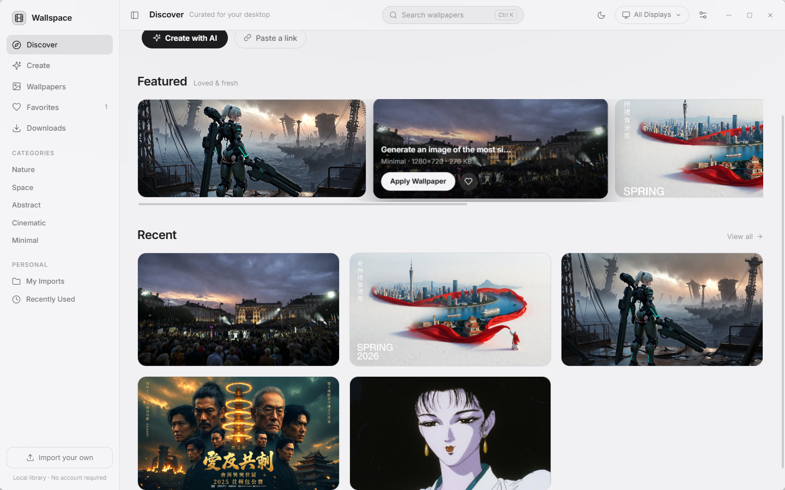
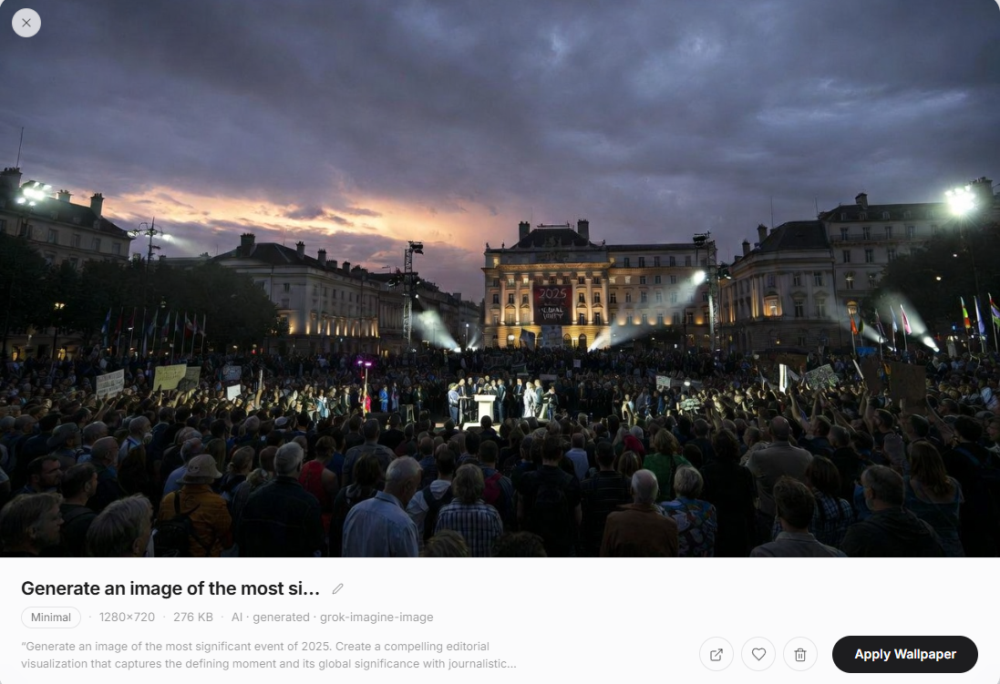
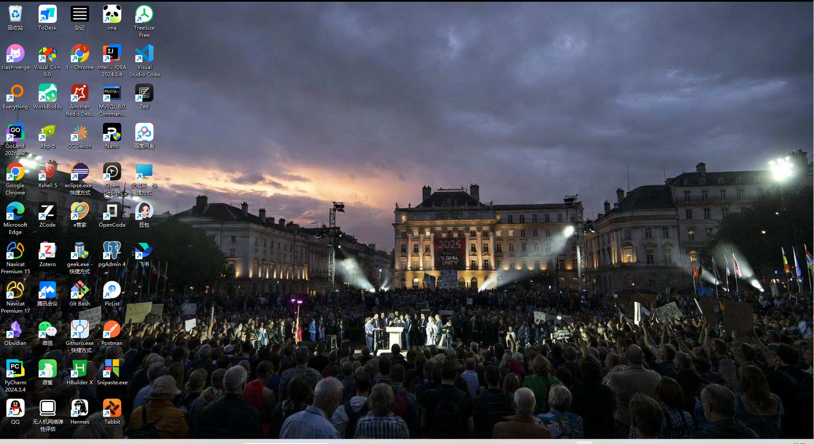
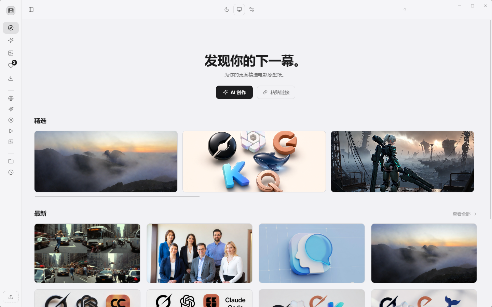
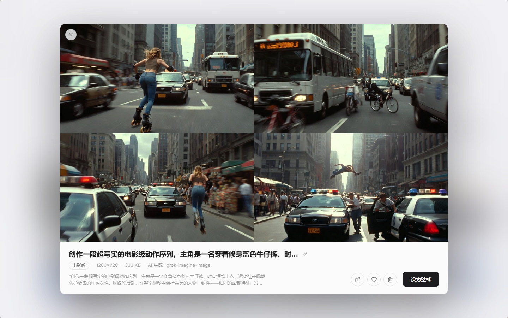

# Wallspace

AI 生图桌面壁纸应用（Windows）· Tauri 2 + Vue 3

生图即壁纸

## 功能

- **AI 生图**
  - **OpenAI 兼容接口** — 设置页配置 Base URL / API Key / 模型（`/v1/images/generations`，b64/url 双回退），支持连接测试
  - **Grok 账号直连** — 与 [grok_switch](../grok_switch) 的 ImagineEngine 同实现
- **一键应用** — 按目标显示器分辨率智能裁剪或完整显示后，通过 `IDesktopWallpaper` 设置系统壁纸；支持每个显示器独立设置或一次应用到全部显示器
- **定时轮换** — 指定一个集合作为轮换来源，按间隔（1 分钟 ~ 2 小时）自动切换，支持仅主屏或全部显示器；重启后按上次位置继续；可选随机挑选（不与当前重复）或日/夜分时模式（白天/夜晚不同集合）；系统托盘可暂停/立即下一张
- **画廊管理** — 生成 / 链接下载 / 本地导入统一入库；重命名、分类、收藏、删除、搜索（Ctrl+K）；删除时原图移入系统回收站，可随时找回
- **备份与迁移** — 一键导出全库备份（壁纸文件 + 集合，zip 格式，不含 API 密钥），换机或重装后恢复备份即可找回所有壁纸；可开启自动备份（每天 / 每周 / 每月），保留最近 5 份
- **层级子分类** — 分类支持多级路径（如 `Nature/Mountains`），侧边栏可展开树、过滤栏父子联动，预览内可新建子分类
- **智能自动打标** — 生图后自动判定分类与标签：内置中英文关键词规则 + 可选轻量文本模型（设置页填写，如 gpt-4o-mini），失败自动回退；旧图可「一键智能整理」批量回填（规则优先，模型兜底），只补空缺不覆盖
- **主色提取** — 每张壁纸自动提取最多 5 个主色，支持按颜色点选过滤
- **标签系统** — 自动打 style/mood 标签（dark / anime / cyberpunk / vibrant…），支持多选过滤与「任一 / 全部」切换
- **分面过滤** — 来源（AI / 下载 / 导入）、宽高比（超宽 / 横 / 方 / 竖）、分类、标签、颜色、分辨率组合过滤；搜索覆盖标题 / 提示词 / 标签 / 分辨率
- **排序与随机换一张** — 壁纸 / 收藏 / 下载 / 最近 / 集合五个列表视图统一结果栏：最新 / 最早 / 名称 / 分辨率 / 随机排序（记忆偏好），「随机换一张」从当前列表随机挑一张立即设为壁纸
- **自定义集合** — 创建 / 重命名 / 删除集合，拖拽卡片排序，预览内一键加入；支持「复制提示词」复用历史 prompt；集合内同样支持排序（自定义 / 最新 / 名称 / 分辨率 / 随机）与「随机换一张」
- **第三方壁纸链接** — 粘贴图片直链即可下载入库，本地保存、离线可用
- **Wallhaven 搜索** — 内置 Wallhaven 公开接口搜索（SFW，无需账号）：关键词 / 热门榜 / 最多浏览 / 随机，可选最低分辨率，结果卡一键导入媒体库，支持分页加载
- **本地导入** — 文件选择器或全窗口拖放（PNG / JPG / WebP / GIF / BMP）；可选监视文件夹，新图片自动入库
- **多显示器** — 工具栏显示器选择器，列出各屏分辨率
- **i18n 中英文** — 设置页切换中文 / English，界面文案全面双语
- **深色 / 浅色主题** — 跟随系统或手动切换，窗口 Acrylic 底色随主题联动；工具栏快捷切换按钮
- **侧边栏收起** — 工具栏按钮或 Ctrl+B 展开/收起侧栏，媒体库全宽浏览
- **快捷键** — Ctrl+K 搜索、Ctrl+B 侧栏、Esc 关闭预览、F 收藏（预览内）；可选全局快捷键 Ctrl+Alt+N 换下一张、Ctrl+Alt+P 暂停/恢复轮换（系统级生效）
- **预览缩放平移** — 大图预览支持滚轮缩放（光标为中心，1×–8×）、拖拽平移、双击在 1×/2.5× 间切换、+ / − / 0 快捷键，缩放比例指示条点击即重置
- **主色调调色板** — 预览详情自动提取图片主色调（最多 6 色），悬停查看 HEX 色值，点击一键复制
- **集合封面自定义** — 集合内右键任意图片「设为封面」，侧栏与集合页显示封面缩略图；未设置时回退集合首图，右键集合可恢复默认
- **色系筛选** — 颜色筛选按 12 个感知色系（红橙黄绿青蓝紫粉棕黑白灰）智能匹配，覆盖同色调深浅变化，替代早期精确 HEX 匹配
- **Wallhaven 颜色搜索** — 下载页 Wallhaven 搜索新增官方调色板颜色过滤（12 色快速色板），按主色调直达目标壁纸
- **集合批量操作** — 集合管理模式下可多选图片，批量加入或移动到其他集合（自动去重、单条汇总提示）
- **导出为…** — 预览内一键裁剪导出：头像 1:1 / 社交竖图 4:5 / 手机 9:16 / 桌面 16:9 / 平板 4:3 预设，cover 模式支持拖拽取景、fit 模式完整显示；亮度 / 对比度 / 饱和度 / 模糊实时调整；JPG / PNG 双格式（PNG 的 fit 模式四边透明），自动记住上次导出设置；可加入媒体库或「另存为…」到任意位置
- **平台头像预设** — GitHub / B站 / 微博 / 抖音头像与 B站头图、微博封面推荐规格，导出后一键打开对应上传页（半自动流），支持整套图包批量导出到文件夹

## Roadmap

### 阶段 2：一键设置各平台头像 / Cover

在现有「导出为…」（本地裁剪导出）基础上，扩展为直接写入各平台：

- **✅ 平台预设扩展（已落地）** — GitHub / B站 / 微博 / 抖音头像与 B站头图、微博封面推荐规格，圆形蒙版预览；导出后一键打开平台上传页（半自动流）；整套图包批量导出
- **平台 API 直传**（需用户授权，规划中）：
  - GitHub：REST `PATCH /user`（avatar_url 需先上传到用户仓库或 Gitee/图床等支持场景）与 Profile README Cover
  - 国内平台多数无开放头像接口，采用「导出 + 打开上传页」的半自动流：一键导出规格图并跳转平台设置页
- **浏览器扩展配合**（可选）— 本地服务与扩展联动，在平台设置页直接注入裁剪结果
- **批量多平台** — 一次导出，按平台规格批量生成整套头像/Cover 图包，打包下载

### 阶段 2 依赖说明

- 阶段 1（本地裁剪导出）已实现 `export_wallpaper` 命令（cover/fit + 归一化取景偏移），阶段 2 的 API 直传复用同一裁剪管线，仅需增加平台鉴权与上传模块

## 预览

### 主界面

### AI 生图预览

### 设为桌面壁纸

### 当前主界面

### 图片详情

